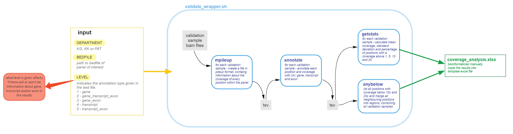

# insilico\_wgs

You can use the files in this repo to :

* create bed files from a refseq-database.
* do a coverage analysis using mpileup and a collection of validation samples sequenced on Illumina NovaSeq and receive a bunch of output files with various coverage stats.

## Create a bedfile 

Resources provided for this task can be found in the `create_bedfile` folder. It contains some scripts and a list of reference sequences (`refseq_20190301_ncbiRefSeq`). Additionally, you will need a list of either genes or transcripts provided from the hospital geneticists requesting new insilico panels. Create your list and save it as e.g. `insilico_panels/KG/[new cool panel]/[new cool panelname].txt`. This list should then be used as input for `create_bedfile/create_bed.py`. Typically KK uses gene lists and KG uses transcript lists.

Here is how to use `create_bed.py` in the two cases:

### Using a list of transcripts

The following command will provide exonic as well as UTR regions:

`./create_bed.py -r refseq_20190301_ncbiRefSeq -t <path/to/transcript/list> -o <path/to/output/folder>`

**options**
`-e 2`  Adds two bases, to make sure splice sites are included as well. This is usually something that KG wants.

### Using a list of genes
The following command will provide introns too:

`./create_bed.py -r refseq_20190301_ncbiRefSeq -g <path/to/gene/list> -o <path/to/output/folder>`

**options**
`-l yes`  Extract the longest transcript for all genes; use in case you want to exclude the introns. (Genes can have overlapping exons of different lengths, and this can be problematic when calculating coverage). KK usually wants all the information they can get, allowing you to run the command without the `-l`flag.
`-e 2` See explanation above.

### The genes/transcripts cannot be found
Sometimes genes or transcripts cannot be found in `refseq_20190301_ncbiRefSeq`. It could be that the transcript has been updated since 2019-03-01 or that the gene name has been changed. If an element of the input list was not found, the script will output a file named notfound.txt. Should the gene/transcript not be present in `refseq_20190301_ncbiRefSeq`there are a few things you can try to solve it:

**Transcripts**
Try deleting the version part of the transcript name in case there is another version present. If there is, check with the person requesting the panel update if it is okay to use the other version.

**Genes**
Check if the gene has another name (e.g. by using [GeneCards database](https://www.genecards.org)) that might be present in `refseq_20190301_ncbiRefSeq`. To replace a name use the script `replace_names.sh <old name> <new name>`. The changes will be saved in `changes_made`.  
<br />

## The insilico\_panels folder

The in silico panels used in WOPR are also stored in this repository. You can find them in the `insilico_panels` folder. Every panel folder contains a gene or transcript list as well as a bed file created by `create_bed.py`. The lists and bed files of the panels currently used by wopr should also be in the WOPR repo:  `WOPR/references/insilico_panels/`. 
<br />

## Coverage analysis (for in silico panel verification into WGS analysis)

The resources provided for this can be found in the `validate_wrapper` folder. In order to do the coverage analysis you will need a bed file for the panel in question.

### How to run
```
# run as root
cd validate_wrapper/
./validate_wrapper.sh /path/to/bedfile.bed [departmentID = KG/KK/PAT] [annotationlevel = 1/2/3/4/5]

# example:
./validate_wrapper.sh /path/to/insilico_wgs/insilico_panels/KK/rubbningar_i_kopparmetabolism.v1.0/rubbningar_i_kopparmetabolism.v1.0.bed KK 1
```
Read more about what annotation levels there are below.

### Result directory
```
/medstore/Development/WGS_validation/in_silico_panels/${department}/validate/panels/
```

## How to get the panel validated
Some of the results from the coverage analysis are to be sent to the responsible clinician as an excel file so they can approve it. There is a template excel that you should fill in as described below.

**Template excel:** Can be found in the Clinical Genomics sharepoint space at [/Dokument/insilico_wgs/template_coverage_analysis.xlsx](https://gunet.sharepoint.com/:x:/s/sy-grp-cgg/EfflqHrzqllKsml24AZQmBkB0-aVjsnp8L-3pde8gzXhYw?e=l7MpUK)

**Paste results to excel file**

Sheet1 - `/general_stats/panelname.bed_stats.tsv`

Sheet2 and 3 - `/anybelow/panelname.bed_10x.csv` and `/anybelow/panelname.bed_20x.csv`

To format the data in excel, mark the column, click "Data" then "Text to columns" and choose "," as delimiter. Et voilà!
<br /> 


## Before placing the panel in routine analysis
A panel has to be approved by the responsible clinician before it can be used in routine analysis.
<br /> 


## Place in silico panel into routine analysis

Make sure to update `WOPR/references/insilico_panels/` with the panel changes you have made. You will also need to update `WOPR/configs/insilico_config.json`. 

In the `insilico_config.json` file each panel requires a specification of the parameter *level*. It is basically a code for the name-structure in the bedfile. It says whether or not it contains gene, transcripts or exons, and in what combination. Two levels are currently in use in routine:

**1** - GeneOnly 

**2** - Gene\_Transcript\_Exon

Ad there are some additional options available as well:

**3** - Gene\_Exon

**4** - TranscriptOnly

**5** - Transcript\_Exon


## validate\_wrapper.sh overview

